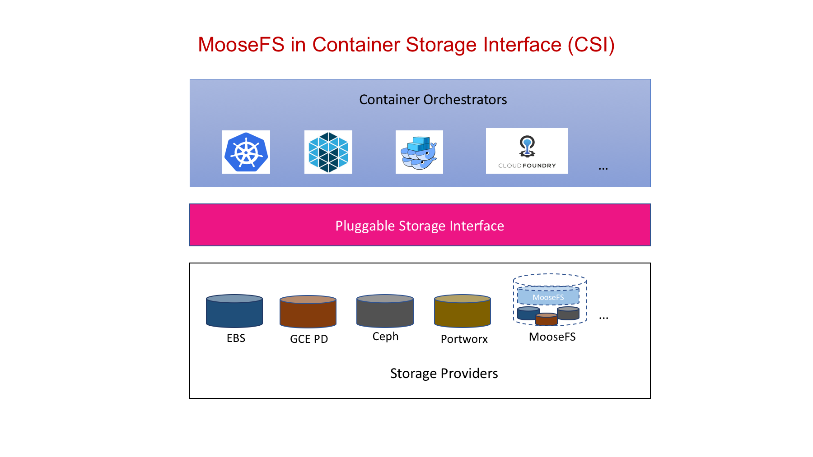
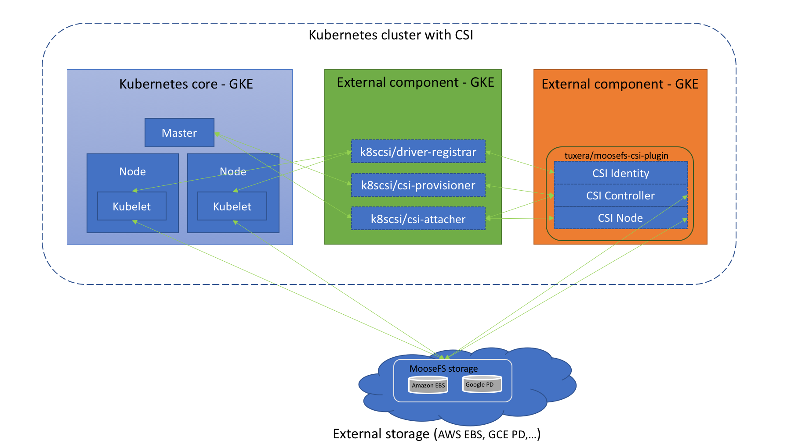

# Container Storage Interface (CSI) for MooseFs
[Container storage interface](https://kubernetes-csi.github.io/docs/) is an [industry standard](https://github.com/container-storage-interface/spec/blob/master/spec.md) that will enable storage vendors to develop a plugin once and have it work across a number of container orchestration systems.

MooseFs is an open-source distributed file system which aims to be fault-tolerant, highly available, highly performing, scalable general-purpose network distributed file system for data centers.

# Introduction
Similar to other storage providers MooseFs can act as a layer on top of hybrid storage. The storage can be distributed across multiple private/public clouds.

[//]: # "image courtesy: https://schd.ws/hosted_files/kccnceu18/fb/CloudNativeCon%20EU%202018%20CSI%20Jie%20Yu.pdf"



# How it works (Kubernetes)
MooseFs abstracts heterogenous storage providers and acts as a single interface. Here, you can see a kubernetes cluster with moosefs-csi in GKE having storage from AWS elastic block store and Google's persistant disk.


# Version Compatibility
| Kubernetes | csi-cluster-driver-registrar| csi-node-driver-registrar |csi-attacher| csi-provisioner| MooseFS CSI AWS  | MooseFS CSI GKE | MooseFS CSI Azure | MooseFS CSI EP (On_prem)  |
|:----------:|:----:|:----:|:----:|:----:|:----:|:----:|:----:|:-------------:|
| `v1.13.1`   | `v1.0.1` | `v1.0.1` | `v1.0.1` | `v1.0.1` | [v0.0.4](https://quay.io/repository/tuxera/moosefs-csi-plugin) |-|-| [v0.0.4](https://quay.io/repository/tuxera/moosefs-csi-plugin) |

# Deployment (Kubernetes)
#### Prerequisites:
* Already have a working Kubernetes cluster (includes `kubectl`)
* AWS/GCP/Azure credentials available (not needed for on premise clusters[EP])
#### Storage deployment topology (Optional)
* Inorder to work with MooseFS, one should choose the MooseFS topology. MooseFS consists of Master and Chunk servers, get to know more about [MooseFS architecture here](https://moosefs.com/blog/architecture/).
* The `topology` to be passed to this plugin should be of format: `master:<Provider>,chunk:<Provider>`. Some valid examples:
    - `master:EP,chunk:EP`, EP here stands for endpoint
    - `master:AWS,chunk:AWS`,
    - `master:AWS,chunk:GCP`,
    - `chunk:AZURE,master:GCP`
* Limitations: As of now, there is support only for: AWS,AWS and EP,EP i.e. the first two example above. The rest of the combinations are under development. 

## AWS EBS storage for your Kubernetes cluster

1. Git clone this repository and add your credentials to `deploy/kubernetes/moosefs-csi.yaml`

2. Apply the container storage interface for moosefs for your cluster
```
$ kubectl apply -f deploy/kubernetes/moosefs-csi.yaml
```
3. Ensure all the containers are ready and running
```
$ kubectl get po -n kube-system
```
4. Testing: Create a persistant volume claim for 5GiB with name `moosefs-csi-pvc` with storage class `moosefs-block-storage`
```
$ kubectl apply -f deploy/kubernetes/sample-moosefs-pvc.yaml
```
5. Verify if the persistant volume claim exists and wait until its the STATUS is `Bound`
```
$ kubectl get pvc
```
6. After its in `Bound` state, create a sample workload mounting that volume
```
$ kubectl apply -f deploy/kubernetes/sample-busybox-pod.yaml
```
7. Verify the storage mount of the busybox pod
```
$ kubectl exec my-csi-app -- df -h
```
8. Clean up
```
$ kubectl delete -f deploy/kubernetes/sample-busybox-pod.yaml
$ kubectl delete -f deploy/kubernetes/sample-moosefs-pvc.yaml
$ kubectl delete -f deploy/kubernetes/moosefs-csi.yaml
```

## Utilize exiting **on-premise** MooseFS storage for your Kubernetes cluster (bare metal)

1. Git clone this repository and add your MooseFS master IP to `deploy/kubernetes/moosefs-csi-ep.yaml` (2 places)

2. Apply the container storage interface for moosefs for your cluster
```
$ kubectl apply -f deploy/kubernetes/moosefs-csi-ep.yaml
```
3. Ensure all the containers are ready and running
```
$ kubectl get po -n kube-system
```
4. Testing: Create a persistant volume claim for 5GiB with name `moosefs-csi-pvc` with storage class `moosefs-block-storage`. The value, 5Gib does not have any significance as for MooseFS the whole filesystem is mounted into the container.
```
$ kubectl apply -f deploy/kubernetes/sample-moosefs-pvc.yaml
```
5. Verify if the persistant volume claim exists and wait until its the STATUS is `Bound`
```
$ kubectl get pvc
```
6. After its in `Bound` state, create a sample workload mounting that volume
```
$ kubectl apply -f deploy/kubernetes/sample-busybox-pod.yaml
```
7. Verify the storage mount of the busybox pod
```
$ kubectl exec my-csi-app -- df -h
```
8. Clean up 
```
$ kubectl delete -f deploy/kubernetes/sample-busybox-pod.yaml
$ kubectl delete -f deploy/kubernetes/sample-moosefs-pvc.yaml
$ kubectl delete -f deploy/kubernetes/moosefs-csi.yaml
```


# Debuging
| Section                  | Issues                            |Commands  |
| -------------            |:-------------                     |:-----    |
| Persistance volume claim |pvc is in Pending state            | `kubectl get events` |
|                          || `kubectl logs csi-attacher-moosefs-plugin-0 -c moosefs-csi-plugin -n kube-system` |
|                          || `kubectl logs csi-provisioner-moosefs-plugin-0 -c moosefs-csi-plugin -n kube-system` |
| Driver name not found    |MountVolume.MountDevice failed for volume "pvc-XYZ" : driver name com.tuxera.moosefs.csi not found in the list of registered CSI drivers | Ensure `kube-apiserver` and `kubelet` has the correct [feature-gates](https://kubernetes-csi.github.io/docs/print.html#deployment-6) enabled (for k8s < 1.14) |

# Developing and contributing

1. Add and commit your changes after forking this repository
2. Run unit tests
```
make test
```
3. After its successfull, create a pull request :heart: :heart: 


# Miscelleneous
| Description                        | Command       |
| -------------                      |:------------- |
|AWS session token creation          |`aws sts get-session-token --duration-seconds 129600` |
|Docker command for launching moosefs|`docker run --cap-add SYS_ADMIN --security-opt apparmor:unconfined -v /dev/fuse:/dev/fuse --privileged -it mfs /bin/bash`


# TODO
* Possibility to define the count of physical disks on servers
* Possibility to define the count of chunk servers
* Automatically generate the best mooseFs configration based on user's need/metrics (how many chunks, topology of servers etc.)
* Possibility to define replication goal (Erosure codes)

# Known Bugs/limitations
* AWS
    - Chunk server creation is not idempotent, sometimes creates more chunk servers than requested causing more disk space available than requested.
    - AWS Security Group is not deleted while decommissioning, needs to be done manually
    - Fargate cluster is not deleted while decommissioning


MountVolume.MountDevice failed for volume "pvc-c3738d2cc47711e8" : driver name com.digitalocean.csi.dobs not found in the list of registered CSI drivers

# License
[Apache v2 license](https://www.apache.org/licenses/LICENSE-2.0)

# Code of conduct
Participation in this project is governed by [Kubernetes/CNCF code of conduct](https://github.com/kubernetes/community/blob/master/code-of-conduct.md)